# Steering Image Models by Identifying Interpretable Steering Vectors With Sparse Autoencoders


By Justin Zhang and Sebastian Prasanna - May 13, 2025

Code is here: https://github.com/sebastian-prasanna/Image-Steering-SAEs

StyleGAN model code can be found here: https://github.com/NVlabs/stylegan2-ada-pytorch

To run the steering code for StyleGAN, you'll need to download the dnnlib folder, torch_utils folder, and legacy.py.

## Introduction and Motivation

Generative models like VAEs, GANs and diffusion models have shown an extraordinary capacity to generate realistic 
and diverse images. However, the latent and activation spaces in these models are not well understood. Prior work 
has shown that certain directions in latent space correspond to semantic changes (e.g., smiling, aging, lighting). 
However, this remains a trial-and-error process, and all state of the art methods require labeling large amounts of
data.


There have been a multitude of advances in the area of activation steering, and numerous such examples have occurred
in the area of Transformer-based language models. For example, Turner et al finds that by finding a phrase that capture
a concept, and a phrase that captures the opposite (e.x. "Love" and "Hate"), one can add in the activations for the 
first phrase and subtract the activations for the second phrase at a certain layer in an LLM on the forward pass of the
model, "steering" the generation of text [1]. This is known as the method of "contrastive pairs".
 


We would like to study whether these techniques are also applicable to image models and not just transformer based text
models. Since the method of contrastive pairs (used in Turner et al on LLMs) is not as applicable to images (it’s hard 
to find very similar images where there is only one relevant difference), we will train a Sparse Autoencoder on 
intermediate latent representations to decompose them into interpretable directions in latent space. After interpreting 
these directions, we will experiment with activation steering to augment the image generation process.
Our work is novel and builds on past work because: 
* It utilizes SAEs instead of contrastive pairs/labeling images. This allows us to capture concepts that aren't explicitly labeled.
* We will experiment across different models types like VAEs and GANs


We predict that intermediate latent spaces will have directions corresponding to highly interpretable features. Given 
success with activation steering in transformer language models, we believe that identifying and adding in these directions 
will give us unprecedented control over the image generation process for image generation models. 
 


## Literature Review


Recent advancements in generative models have significantly improved the realism and diversity of synthesized images. 
However, understanding and controlling the latent and activation spaces of these models remain challenging. Researchers 
have been exploring various techniques to interpret and manipulate these spaces to achieve more controllable and 
interpretable image generation.


Shen et al. (2020) proposed a method for interpreting the latent space of GANs by analyzing the correlation between 
latent variables and the corresponding semantic contents in generated images. Specifically, they train a Residual Network
on the CelebA dataset to identify certain atributes in images (like smiling, or pose), and then find the hyperplane
in the GAN's latent space that best separates certain atributes. For example, if the atribute of choice was smiling, 
they would find the hyperplane that best separates latents that produce smiling images from latents that don't produce 
smiling images. The steering vector for smiling is thus the unit vector normal to this hyperplane.
By intervening in the latent variables of a pre-trained GAN model, they demonstrated that certain dimensions in the 
latent space are responsible for specific semantic features, enabling controllable concept manipulation in generated images [2]. 


Cheng et al. (2022) explored the use of Variational Autoencoders (VAEs), specifically Beta-VAE and DFC-VAE, for facial 
expression synthesis. By performing latent space arithmetic, they demonstrated the ability to manipulate specific facial 
attributes, such as widening a smile or narrowing eyes, by adjusting the latent representations. This work underscores the 
effectiveness of VAEs in learning disentangled representations for controllable image synthesis. To find steering vectors,
they use the contrastive pairs method, encoding many images, splitting them into images with an atribute, and images without
and then subtracting the average latent representations from those 2 classes to yield a steering vector [3].


We build on the literature by proposing a method that requires no labeled data to interpret latent vectors. By simply
visualizing images that have high activation on a certain neuron, and by steering images with the latent vector,
we can identify steering vectors without labeling images using a Residual Network or class labels. To demonstrate
the power of this method, we identify steering vectors in a VAE we train on the CelebA dataset, and on the pretrained model
StyleGAN. We find that our method encodes concepts far more complicated than those previously identified in the literature.


## A Quick Explanation of Sparse Autoencoders (SAEs)

Autoencoders are neural networks trained to reconstruct their input by encoding it into a lower-dimensional space and 
then decoding it back. They learn a compressed representation of data by forcing information through a bottleneck layer. 
While effective at capturing structure, standard autoencoders tend to learn dense and entangled representations—where each 
latent unit often mixes many unrelated features.

Sparse Autoencoders (SAEs) introduce a critical improvement: they constrain the latent representation to be sparse. 
This means that, for any given input, only a small number of neurons in the hidden layer are allowed to activate. The goal is 
to encourage the model to find a disentangled basis: a set of features where each dimension captures a distinct and 
semantically meaningful aspect of the data. Note that we use tied-weights SAEs for our experiments: the decoding matrix
is the transpose of the encoding matrix.
 
$$x̂ = W^{T}(ReLU(Wx))$$

To encourage sparsity, SAEs add a penalty to the loss function. A typical formulation might include an L1 regularization 
term on the latent vector (this is what we use):
 
$$L = \|x - x̂\|^2 + λ \cdot \|z\|_1$$

Here, `x` is the input, `x̂` is the reconstruction, `z` is the latent encoding, 
and `λ` controls the strength of the sparsity penalty (we use `λ = 0.5`). 
The L1 norm `||z||₁` encourages many entries in `z` to be zero. Only a few neurons fire for 
any given example, forcing the autoencoder to learn a distributed set of specialized features.

Sparsity leads to disentanglement for two key reasons. First, since only a small number of neurons can be active, 
each must learn to represent a distinct, high-utility feature to justify its activation. Secondly, sparse activations reduce 
interference between features. This makes it easier for each neuron to align with a specific, interpretable concept (
e.g., “glasses”, “smile”, or “shadow”).
 

## Activation Steering

Activation steering is a technique used to modify the internal activations of a neural network to induce specific 
behaviors or attributes. Given a steering vector `v`—typically derived from the difference between two 
activation patterns—and an injection coefficient `c`, the activation `a` at a particular layer 
can be modified as `a' = a + c · v`. This allows fine-grained control over model outputs, such as inducing 
features like "smiling" in image generation models by pushing in the direction of concept-aligned vectors.
 

## Why SAEs are Relevant to Steering


A trained **Sparse Autoencoder (SAE)** learns a weight matrix `W` in its encoder that maps 
input activations to sparse latent features. Suppose the SAE maps from a 512-dimensional latent space to a 
1024-dimensional sparse representation space, and then back to the 512-dimensional space. Then the W is a 1024 x 512
matrix. Each row of `W` corresponds to a distinct feature direction in the original activation space.
This is because the SAE maps from a sparse representation `[a₀, a₁, a₂, …]` to 
 
$$\sum_{i=0}^{1024} a_i \cdot v_i$$

Where v\_i are the row vectors of the weight matrix. Note that to decode the sparse representation, we multiply by
the transpose of the weight matrix (so columns of the transpose are rows of the original). Thus the relevant
steering vectors are the 512-dimensional rows of the weight matrix.
 


## Experiments with Variational Autoencoders


Now, we move our focus to variational autoencoders (VAEs). We trained a model with two stages. Those two stages were a VAE 
first and then a Sparse Autoencoder (SAE). The purpose of the VAE in the first stage is in order to learn a compressed version
of the face images in the CelebA dataset by creating a latent representation [4]. The purpose of the next stage, which is the
SAE, is to build on top of the VAE’s latent space to create a new sparse representation on top of the VAE latent 
representation layer [5]. Once this training was completed, we analyzed and visualized the learned features, and did 
numerous experiments, which we describe further below.


We first start by describing the general structure of our algorithm and some of the logistics and 
technical details as to how we implemented our training algorithm. The first step is to load in the data, 
which we did via a function called get\_celeba\_dataloader(), whose purpose is to both load in and preprocess the 
CelebA dataset [6]. Then, the next step of our pipeline was a train\_vae() function. For the purposes of our experiment 
and with our available computational resources, we opted to train a VAE on 15 epochs. Furthermore, we also saved a local 
copy of the weights every 5 epochs to ensure and keep track of the progress of the training while running. Subsequent 
to the VAE Training comes the latent extraction, which was done by an extract\_latents() function. This function runs 
the VAE on the CelebA dataset that we had downloaded earlier in order to extract and locally save the resulting latent vectors. Recall that these latent vectors are extracted from the encoder part of the VAE. The reason that we save these latent vectors locally is to utilize them in the next part of our algorithm, which is the aforementioned second stage, namely, the SAE training. This was done using the train\_sae() function, which uses the saved VAE latents from the prior extract\_latents() function and trains a Sparse Autoencoder on them. In the coding implementation, we also added optimizations for sparsity and also more accurate reconstruction, such as adding in a feature to resample unutilized features at periodic intervals. This is in order to ensure that no features are ignored and to try to utilize all of the available features.


For the start of the actual analysis and experimentation, we first start by using the torch.topk function to find the 
indices of the ten most active features from my SAE over the CelebA dataset. For a more detailed and thorough step by 
step explanation, we iterate over batches of images, where our aforementioned VAE encodes the images and we calculate 
and store the mean absolute activations for every feature in the SAE’s hidden layer listed in the file list\_attr\_celeba.txt 
on the CelebA dataset website located at https://mmlab.ie.cuhk.edu.hk/projects/CelebA.html [6]. There are a multitude of 
ways to approach the next steps of the analysis, but we chose to maintain a running average of the aforementioned mean 
absolute activations over all the batches. In our analysis, we found that a batch size of 128 worked best. We stored 
these running averages in a vector called average\_activations, and since there are 512 possible SAE features, this 
average\_activations vector has size 512. Once again, recall that every entry in this vector will be equal to the mean 
of the absolute activations over all batches in the test data set for that feature. 


After this, we use the torch.topk function to identify the 10 most active features in the SAE using the mean average 
activation metric that we just described. We concluded that this was the best metric to use, in contrast to other 
metrics of “activeness,” as an average over all batches of the dataset is able to capture and take into account 
properties of the entirety of the dataset. 


Upon running the part of the experimental pipeline described, we got that the indices among the size 512 
average\_activations vector that are most active are [383, 186, 447, 120, 443, 479, 63, 228, 124, 55]. 


We then generated images in order to visualize how altering a single feature corresponding to a particular index 
in the SAE and its latent space would have an impact on the image produced through the conjunction of the VAE and 
SAE model. Some experimental results we got were as follows. In our descriptions below, when we say trait $n$, we 
are referring to the trait with index $n$ in the average activations vector.
 


We found that, among the traits in the list of the 10 most active traits on average over the batches that we list above:
1. Trait 447 corresponds to a change in pose
2. Trait 479 corresponds to a change in the hair by darkening
3. Trait 228 corresponds to a change in gender from female to male.
4. Trait 124 corresponds to a change in the location of the hair from the right side to the left side.
5. Trait 55 corresponds to a change in the hair by lightening the hue.


We show the generated images below, as the activation scale varies from -10.0, -4.0, 0.0, 5.0, 10.0. 
These numbers serve as a representation of the strength with which you activate the specific feature.


The following images demonstrate the images generated as the activation scales vary through the values listed above 
from -10.0 to 10.0 for Trait 447, the change in pose. 


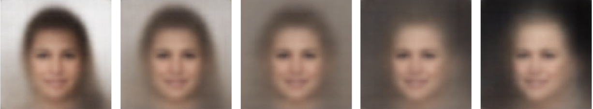

The following images demonstrate the images generated as the activation scales vary through the values listed above 
from -10.0 to 10.0 for Trait 479, the change in hue from light hair to dark hair.


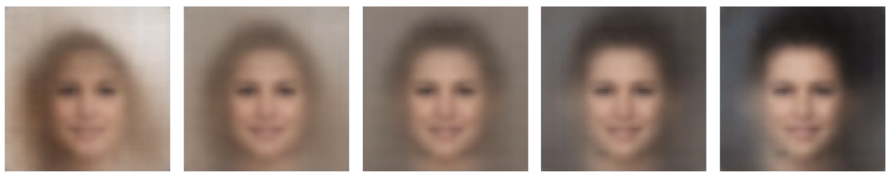

The following images demonstrate the images generated as the activation scales vary through the values listed above 
from -10.0 to 10.0 for Trait 228, the change in gender from female to male. 


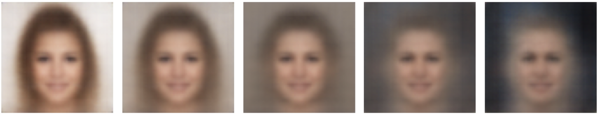

The following images demonstrate the generated images as the activation scales vary through the values listed above from 
-10.0 to 10.0 for Trait 124, the change from hair on the right side to hair on the left side.


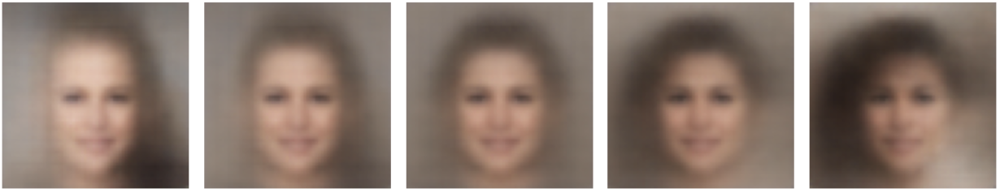

The following images demonstrate the generated images as the activation scales vary through the values listed above from 
-10.0 to 10.0 for Trait 55, the change in hair hue from dark to light.


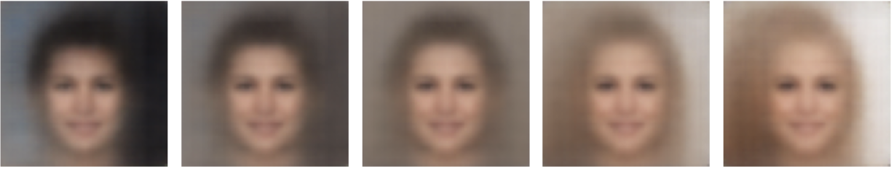

As one can observe, one interesting property of these traits is that Trait 479 and Trait 55 appear to be effectively 
“inverse” traits, since they undo each other’s functions. This was also a common pattern that we observed in the case 
of GANs earlier, and it is an interesting property that we noted several times throughout our experimentation. 


We also ran some additional experiments with source and target images, altering source images to attempt to change towards 
a target image. One example is shown below. On the left side is depicted a picture of a woman, and on the right is shown 
a picture of a man. As one can see, the gender trait is added to the woman and her face becomes more similar to one with 
male features. However, one can also observe some properties of entanglement, as her skin shade also becomes darker and 
she develops other traits that are not strictly relevant to gender. 
 


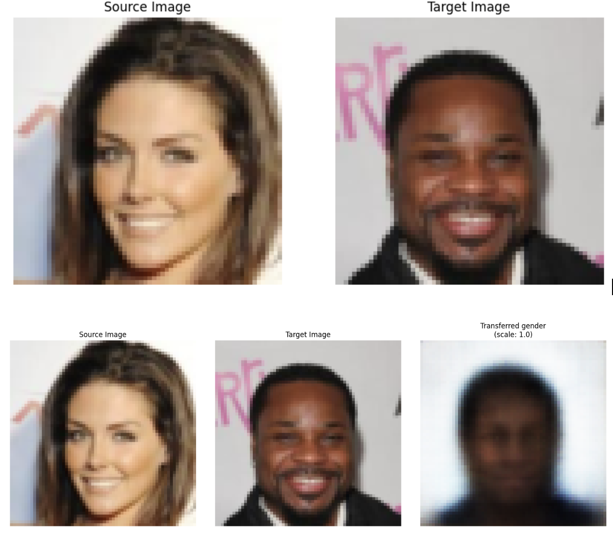

Another similar instance is shown below, with the same female to male transition. 


We have two images, namely, a source image, which occurs at alpha = 0.0, and a target image, which occurs at 
alpha = 1.0. We then encode both of these images into the SAE latent space, and perform a linear interpolation 
as a linear combination of source multiplied by a factor of 1-alpha and the target multiplied by a factor of alpha. 
We take this linear combination as alpha ranges from 0 to 1. Upon doing so, we then follow by decoding the latent 
object that is interpolated back into an image. This experimentation and visualization is significant as it shows that 
we can effectively make “combinations" of traits by linear combinations of images with our desired traits.


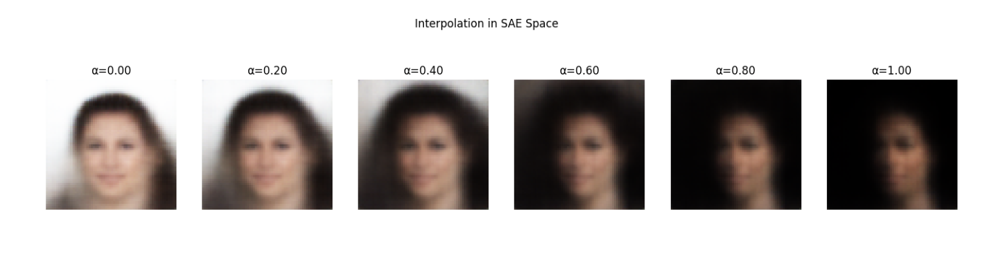
## Steering with StyleGAN


### **What is StyleGAN?**


StyleGAN (Style-based Generative Adversarial Network), introduced by Karras et al. in 2019, marked a significant leap in image synthesis quality.
Unlike traditional GAN architectures that feed a latent vector directly into a generator, StyleGAN uses a style-based architecture that introduces 
new latent spaces and transformations to give greater control over image attributes. One of the central innovations in StyleGAN is the introduction 
of an intermediate latent space called W space, which fundamentally changes how images are generated and manipulated.


In a standard GAN, a latent vector `z ∼ 𝒩(0, I)` is passed directly into the generator `G(z)`. In 
StyleGAN, however, this process is decoupled. First, `z` is mapped through a learned mapping Network
`f` to produce a new latent vector:
 
```
w = f(z)
```

This vector `w ∈ 𝒲` lies in a space that is typically more disentangled than the original `𝒵` space.
While `𝒵` is Gaussian and highly entangled, the mapping function `f` "warps" this space into a more 
semantically meaningful structure. Notably, this latent space should linearly represent concepts, which means activation
steering should be effective!


The generated vector `w` doesn't feed directly into a convolutional generator. Instead, StyleGAN uses **adaptive instance normalization (AdaIN)** to control the activations at each layer of the synthesis network.
Each layer of the synthesis network receives styles derived from `w`, allowing features such as pose, lighting, and texture to be adjusted independently.
Formally, if `xl` is the activation at layer `l`, the AdaIN operation can be written as:
 
```

  AdaIN(xₗ, w) = σ(wₗ) · (xₗ - μ(xₗ)) / σ(xₗ) + μ(wₗ)
    
```

where `μ(·)` and `σ(·)` denote the mean and standard deviation, and `wₗ` refers to the layer-specific transformation of `w`.


For these experiments, we have `wₗ = w` for all layers `l`. In future experiments, we could train
an SAE on all 14 latent spaces (the `𝒲⁺` space), but for this post, we only train on the original `W` space.


### **Steering Results with StyleGAN**


We train an SAE on the W space of StyleGAN2, mapping the 512 dimensional W space to an 1024-dimensional sparse representation
space. We ran multiple training runs, and surprisingly found the SAE that balanced reconstruction loss and sparsity the best 
was trained for only 10 epochs on a dataset of 640,000 latents vectors generated by StyleGAN2's mapping network. We experimented
with resampling dead latents that didn't fire often (specifically, they're average activation was less than 0.0001), but this 
counterintuitively significantly decreased reconstruction loss, though it slightly improved sparsity. Ultimately, the SAE
trained on 10 epochs without resampling showed more interpretable latent vectors than the SAE's trained for 30 and 35 epochs 
with resampling. Here are the losses on the validation set during training.


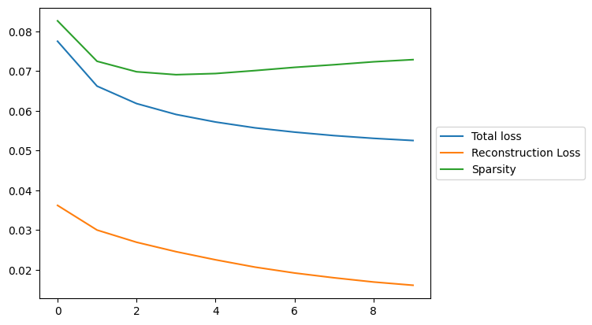

The sparsity loss during training is also interesting. It seems the model sacrifices sparsity at the beginning to achieve 
good reconstruction loss, then brings the sparsity down.


Because the SAE disentangles the `W` space in an unsupervised way, we don't require class labels for this method,
which significantly increases the range of possible concepts we can identify in latent vectors. Past research has identified
steering vectors for simple concepts like smiling, pose and gender. Because our method doesn't require class labels, we find
steering vectors for far more abstract concepts. By only examining the first 20 latent vectors (sorted by average activation),
we identify steering vectors for:


1. Gender
2. Pose
3. Hats
4. Bangs
5. Sunglasses
6. Hair Swooping Left
7. Hair Swooping Right
8. Hair Darkening
9. Hair Lightening
10. Background Darkening
11. Background Lightening
12. Voluminous Black Hair
13. Chin Tucked


Notably, the vector for "smiling" doesn't seem to appear in the top 20 (but it does in the top 30)!
Unfortunately, the features aren't perfectly disentangled by the SAE, but most steering vectors yield one clear atribute,
and might be entangled slightly with another atribute. For example, some of the pose steering vectors also tend to change
the gender of the image. In the top 20 steering vectors (by average activation), there are only 3 that we don't find concise
natural language descriptions for. This may also be because we didn't notice the concept that the vector represents.
Additionally, there are multiple steering vectors that seem to represent similar concepts. We find 3 vectors that encode 
gender in the top 20.


Since there are far too many steering vectors to demo, we choose a few interesting ones that don't seem to have been
identified by previous works. We start with the "average image", and then inject the steering vector before we synthesize
the image using StyleGAN2. The injection coefficients from left to right go from -2 to 10, equally spaced along the way. 
That is, the left image results from taking the average SAE activations, subtracting 2 from the relevant neuron, then 
decoding into the 512-dimensional latent space, and then generating the image using StyleGAN. This is what the "average
image" looks like. We find it by averaging all sparse activations over the test dataset, and then decoding it and running
it through StyleGAN.


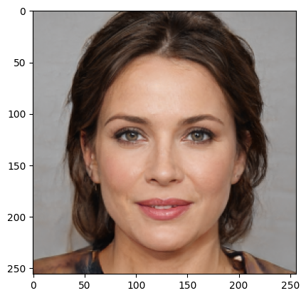

Hats:


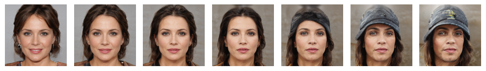

Hair Swooping Left:


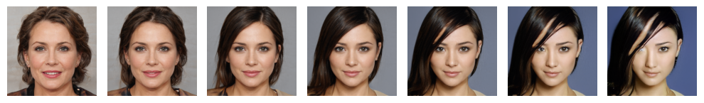

Voluminous Black Hair:


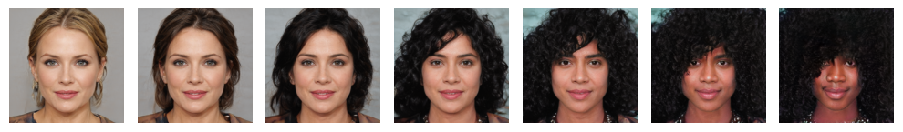

We can also test steering vectors on random images! Here are 7x7 grids of random images, being steered. The injection
coefficients go from 0 to 6, with 7 steps (so the image on the far left is the original image).


Hair lightening:


Chin tucked:


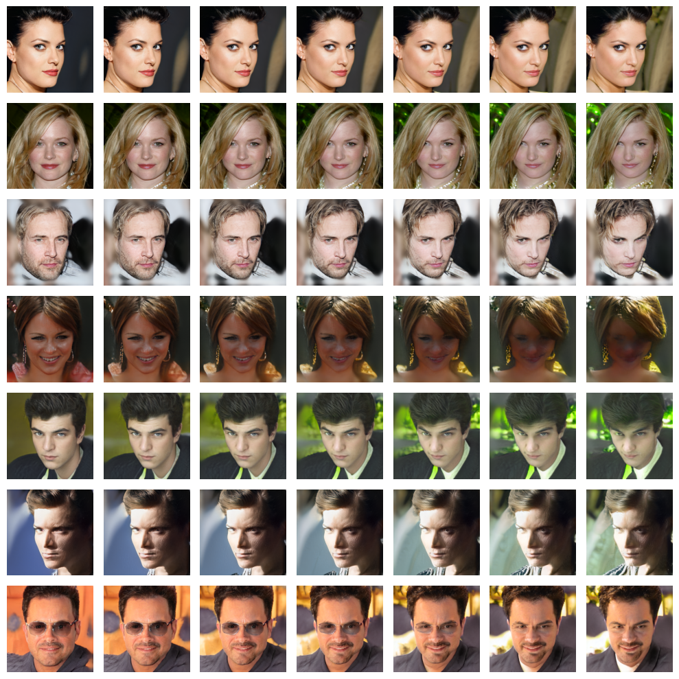

Some of the images aren't perfect, but most of them look pretty good! We can also combine multiple features by steering
in multiple directions.
We'll start with the average activations, and then add in a bunch of features. Let's try turning our "average activations" 
woman light-haired (steering vector #5) and gaunt (#859), and give her bangs (#1002 and # 833) and a dark background (#581).


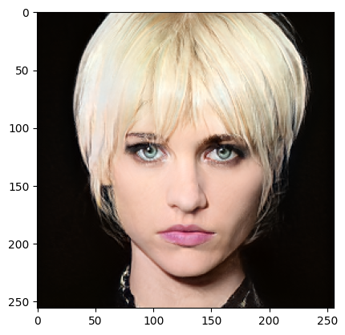

Or a man (#298) with curly dark hair (#888), face turned right (#424) and smiling (#195)


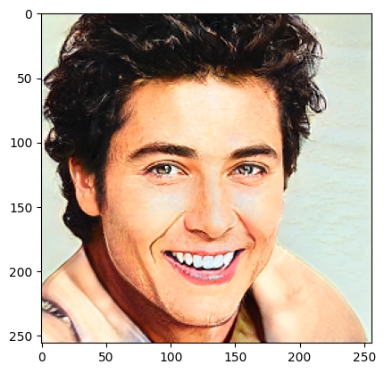

Both of these images were steering from the same original image!


## Conclusion


In conclusion, we find that SAEs are a powerful tool for disentangling interpretable concepts in the latent spaces
of image generative models. Additionally, we find that the latent vectors identified by SAEs act as effective steering 
vectors. We were able to inject these vectors into the forward pass of generative image models to generate new images
that follow the user's design. Ultimately, our experiments showcase the effectiveness of applying interpretability methods
to understanding and augmenting image generative models.


A key limitation of our method is that we must individually interpret each SAE latent. Since there are 1024 of them, 
we only interpret the few with high average activations. Future work could investigate ways to automate this process.
 


## References


[1] Alexander Matt Turner, Lisa Thiergart, Gavin Leech.
[Steering Language Models With Activation Engineering](https://arxiv.org/abs/2308.10248)
arXiv preprint arXiv:2308.10248, 2024.


[2] Yujun Shen, Jinjin Gu, Xiaoou Tang, Bolei Zhou. 
[Interpreting the Latent Space of GANs for Semantic Face Editing](https://arxiv.org/pdf/1907.10786) . arXiv preprint arXiv:1907.10786, 2019.


[3] Gore Kao, Shirley Kokane, Vivian Cheng 
[Interpreting Latent Representations via Sparse Feature Factorization](https://www.andrew.cmu.edu/course/16-726-sp22/projects/vccheng/project/) . CMU 16-726 Project, Spring 2022.


[4] Kingma, D. P., & Welling, M. (2014).
[Auto-Encoding Variational Bayes.](https://arxiv.org/abs/1312.6114) 
arXiv preprint arXiv:1312.6114


[5] Ng, A. (2011). Sparse Autoencoder. CS294A Lecture Notes, Stanford University.


[6] Liu, Z., Luo, P., Wang, X., & Tang, X. (2015). Deep Learning Face Attributes in the Wild. 
[Deep Learning Face Attributes in the Wild.](https://mmlab.ie.cuhk.edu.hk/projects/CelebA.html) 
Proceedings of the IEEE International Conference on Computer Vision (ICCV), 3730-3738. 
 


